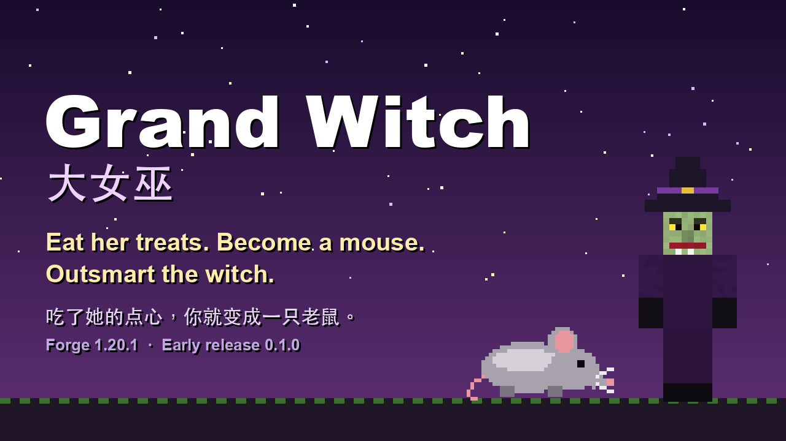

# 大女巫 · Grand Witch

[English](README.md) · [简体中文](README.zh-CN.md)



*（用模组自己的贴图拼的宣传图，不是游戏截图。）*

**吃了她的点心，你就变成一只老鼠。**

一个 Minecraft **Forge 1.20.1** 模组。大女巫会在有小孩的村子附近出现，扮成村民、流浪商人、提篮子的少女、老太婆或保姆，用点心跟你换食物。她给你的东西**可能加了料**，吃下去，你就变成老鼠。

变成老鼠是完全不同的玩法：世界变得巨大，猫来追你，女巫看见你就要踩你。但老鼠也能钻进玩家去不了的地方，而且女巫也可以被反将一军。

| | |
|---|---|
| Minecraft | 1.20.1 |
| 加载器 | Forge 47.x（不需要别的模组） |
| 运行端 | 客户端和服务器都必须安装 |
| 许可 | MIT |
| 版本 | 0.1.0 —— **早期版本** |

> **状态。** 游戏从头到尾能玩，有自动测试（无界面的游戏内测试）覆盖，但**真实游玩测试还很少**：画面和手感（姿势、长手臂、扫把、鼠笼、发光）没怎么看过，**联机 / 专用服务器没有测试**。遇到奇怪的地方请提 issue。
>
> **AI 声明。** 本项目的代码、文案和图片由 AI（Claude）协助制作。

---

## 目录

- [女巫](#女巫)
- [她的小屋](#她的小屋)
- [变成老鼠之后](#变成老鼠之后)
- [反击](#反击)
- [配方](#配方)
- [扫把](#扫把)
- [世界里](#世界里)
- [命令](#命令)
- [配置](#配置)
- [安装](#安装)
- [从源码构建](#从源码构建)
- [已知的限制](#已知的限制)
- [许可](#许可)

---

## 女巫

她会自己出现：游戏大约每分钟看一次每位玩家，如果附近 48 格内有**小孩村民**（并且 160 格内没有别的大女巫），她有 30% 的概率来（只有成年村民时是 5%）。她不会一直待着：没人理她，大约八分钟后就冒一阵烟消失。

她有**四种**，各有各的骗法（比例可以在配置里改）：

| 种类 | 做什么 |
|---|---|
| **送礼少女**（提篮子的少女） | 送你一块蛋糕。*吃下去的时候才决定它是什么：* 一半是奖励（金苹果、绿宝石……），一半让你变老鼠。她会先去找小孩。 |
| **卖药婆** | 用 2 个绿宝石卖药水。看着都是好药，其中 40% 同时带着变鼠药水。 |
| **诅咒礼物商人** | 给你一件好东西——但它被诅咒了。带着它大约 90 秒，你就变成老鼠。（走到三分之一和三分之二时会有提示。） |
| **保姆** | 把最多 3 个村里的小孩叫到身后，慢慢带回她的小屋，变成老鼠，**关进鼠笼**。只在有小孩的地方才会出现。 |

她被识破之前，看起来是村民、商人，或者她自己的几张脸。她显出原形的时候，**村里的钟会响**，她会发光十秒。

她还会：

- **把小孩变成老鼠**；配置打开的话，也包括成年村民（每次来访一个）和她遇到的**任何小僵尸**（永久）。几分钟后他们会变回来，或者喂牛奶（喂给那只老鼠）、给解药、女巫死掉。
- **对老鼠发狂。** 变成老鼠的玩家、变成老鼠的小孩会让她暴怒：跑得更快，**踩老鼠**（约每 0.7 秒 3 颗心），对视线里的玩家**扔变鼠药水**。
- **会开门**，追 6 格外的人时**骑扫把**。
- **伸手进洞里抓。** 你躲进隧道，她会走到隧道**侧面的洞口**，**趴下，顺着隧道把手臂伸进去，拐弯也跟着拐**，最长 5 格，把你拖出来。老鼠在**第 6 格**时，她会随机试探一下，有 1/5 的概率抓到；第 7 格是 1/10；再往里她就够不着。侧面没有洞口的隧道，她完全抓不到。
- **不会一直站在你头顶。** 你躲在她够不到的隧道里，几秒后她就放弃，你逃掉以后，过一会她也会走。
- **会被骗。** 她有时（30%）闻出食物被加了料；没闻出来就吃下去。

## 她的小屋

一座小木屋，只建在平坦的空地上：云杉屋顶、火上煮着药的药锅、书架、一个放着**解药**的箱子、一座放着**日记**的讲台（九页，是她自己的口吻）、酿造台、一个**关着两只抓来的老鼠的鼠笼**（铁栏杆加栅栏门）、墙边的老鼠洞，门廊上有灯笼。

- **谁闯进来**，她就扑向谁：显出原形，跑回来（离得远就直接一阵烟出现在门口），追三十秒。
- 保姆把变成老鼠的孩子**关进鼠笼**，他们会一直是老鼠，直到有人把他们放出来再治好。
- 小屋空了——女巫死了或走了——附近有玩家时（96 格内），每分钟有 2% 的概率来一位新女巫。

## 变成老鼠之后

- **身子小、快 60%、夜视。** 不能放、挖、用方块（也不能骑扫把）。
- **会自己吱吱叫**，大约每半分钟一次，32 格内的猫都会转向你。蹲下就安静。
- **对你危险的东西——女巫、猫、怪物——隔着墙发光**，20 格内，只有你自己看得见。
- 在软土（泥土、草方块……）里**挖十字形隧道**，想挖多长挖多长，上面保留草皮，可以种东西。
- 能钻**半格高的缝隙**，走进**老鼠洞**，**啃箱子里的食物**。
- 视野偏冷、褪色（红色和黄色仍然鲜艳）、更窄、四角发暗。
- **四分钟后**变回来，或者更早：喝**解药**，或者弄你的那个女巫死掉。（牛奶可以在配置里打开。）

## 反击

- **给她的食物加料。** 变鼠药水加任意食物，在工作台里合成，得到一份外表一样的点心，给女巫吃（她伪装着的时候可能闻出来）：**她自己变成老鼠**一分钟，5 颗心，拼命逃，所有猫都去追她。
- **变鼠药水对任何生物有效**——牛、僵尸、村民……除了 Boss。它们变成**还是它们自己**的老鼠，大约五分钟后变回来（或者喂牛奶）。喝的、扔的、箭上的都行。
- **杀野生老鼠**（要玩家亲手杀，猫杀的不算）有 25% 概率掉**鼠疫病毒**（抢夺每级 +10%），女巫死时有 50% 掉。药水就是用它酿的。

## 配方

| 物品 | 怎么得到 |
|---|---|
| **变鼠药水** | 酿造台：粗制药水 + **鼠疫病毒**。加火药变喷溅，加龙息变滞留，和原版一样。 |
| **变鼠药水箭**（×8） | 工作台：8 支箭围着 1 瓶变鼠药水（喝的、喷溅的、滞留的都行），瓶子还给你。 |
| **加了料的点心** | 工作台：1 瓶变鼠药水 + 1 份食物，瓶子还给你。 |
| **解鼠药剂** | 金胡萝卜 + 蜘蛛眼 + 玻璃瓶（得 1 瓶）；或者丢进火上有水的药锅（得 2 瓶）。喝下去变回来，对着老鼠右键喂给它。 |
| **老鼠洞** | 圆石 + 线。 |
| **木扫把** | 2 根木棍在上，下面 2 个小麦。 |
| **金扫把** | 2 根木棍在上，下面 3 个金锭。 |

## 扫把

**低空**骑。按住**空格**升高，抬头低头调整高度，蹲下下来（蹲着右键可以收起扫把）。木扫把悬停约 1 格，最高 3 格（约每秒 5.6 格，能飞 300 秒）；金扫把悬停 1.5 格，最高 6 格，更快（约每秒 10 格，能飞 900 秒）。女巫有事要赶路时也会骑一把。

## 世界里

- **老鼠洞**会自己出现在平原、森林、丘陵里软土土坡的侧面（从洞口往里有两三格隧道），洞边有几只**野生老鼠**。（只对设置打开之后新生成的区块生效。）
- **野生老鼠**也会在主世界任何生物群系的地面上偶尔出现几只。

## 命令

需要管理员权限（权限等级 2）：

| 命令 | 作用 |
|---|---|
| `/grandwitch witch` | 叫一位女巫来（带小屋）。 |
| `/grandwitch hut` | 在你面前搭一座她的小屋。 |
| `/grandwitch mouse` | 把你变成老鼠，再输入一次变回来。 |
| `/grandwitch cure` | 治好你自己。 |

## 配置

`config/grandwitch-common.toml`。上面写到的几乎每个数字都是配置项。一部分如下：

| 配置项 | 默认值 | 说明 |
|---|---|---|
| `enabled` | `true` | 她会不会自己出现 |
| `chance` / `checkSeconds` | `0.3` / `60` | 她多久来一次 |
| `mouseSeconds` | `240` | 玩家当多久的老鼠 |
| `childMouseSeconds` | `300` | 小孩（或任何生物）当多久的老鼠 |
| `milkCures` | `false` | 牛奶能不能让老鼠玩家变回来 |
| `giftPoisonChance` | `0.5` | 送礼蛋糕是变鼠的概率 |
| `stompDamage` | `6.0` | 她一脚踩的伤害（2 = 一颗心） |
| `catsHunt`、`squeakSeconds` | `true`、`30` | 猫追不追老鼠、老鼠多久叫一次 |
| `dangerSense` | `true` | 老鼠能不能看到危险隔墙发光 |
| `witchReach` | `true` | 趴下伸长手臂进洞抓 |
| `witchBroom`、`witchBroomSpeed` | `true`、`0.33` | 女巫骑扫把 |
| `turnsChildren`、`turnsAdults`、`turnsBabyZombies` | `true` | 她把谁变成老鼠 |
| `kindGift` / `kindPotion` / `kindCurse` / `kindNanny` | `35 / 25 / 20 / 20` | 四种女巫的比例（设为 0 就关掉这一种） |
| `plagueVirusChance`、`plagueVirusWitchChance` | `0.25`、`0.5` | 鼠疫病毒的掉落率 |
| `worldMouseHoles`、`worldMouseHoleChance` | `true`、`0.03` | 世界里的老鼠洞 |
| `hutRespawn`、`hutRespawnChance` | `true`、`0.02` | 空小屋刷新女巫 |
| `witchHut`、`hutAlarm`、`villageAlarm` | `true` | 小屋和警报 |

## 安装

1. 安装 **Minecraft 1.20.1** 和 **Forge 47.x**。
2. 把 `grand-witch-forge-1.20.1-0.1.0.jar` 放进 `mods` 文件夹（服务器也要放）。
3. 启动游戏，在创造模式的世界里试试 `/grandwitch witch`。

## 从源码构建

需要 Java 17。

```sh
./gradlew build                  # build/libs/grand-witch-forge-1.20.1-<版本>.jar
./gradlew runGameTestServer      # 跑自动化的游戏内测试（无界面）
./gradlew runClient              # 带着模组启动游戏
```

> `gradle.properties` 里有一行 `org.gradle.java.home=...`，指向作者 Mac 上 Homebrew 装的 Java 17。你的 Java 在别处的话，请改掉或者删掉这一行。

代码在 `src/main/java/com/xiaofeiwu/grandwitch`（女巫是 `GrandWitch`，老鼠状态是 `Mice`，小屋是 `WitchHut`）；测试是 `GrandWitchGameTests`，每个行为一条。

## 已知的限制

- 联机 / 专用服务器：**没有测试**。
- 真实游玩里没怎么看过：女巫趴下的姿势和长手臂、扫把的手感、鼠笼、发光、洞穴生成。这些是按"在无界面环境里能检查到的"做到最好。
- 少数几条测试（女巫伸手进洞）偶尔、很少地失败过，原因还没找到。
- 药水箭用的是对"效果"的测试，没有真射一支箭验证。
- 没有和别的模组一起测试过。

## 许可

[MIT](LICENSE)。Minecraft 和 Forge 归各自的所有者；这是一个非官方模组，与 Mojang 和微软无关。
